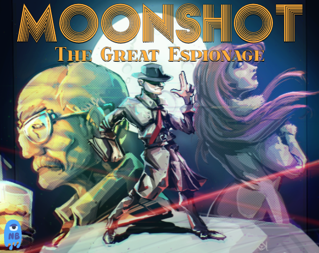
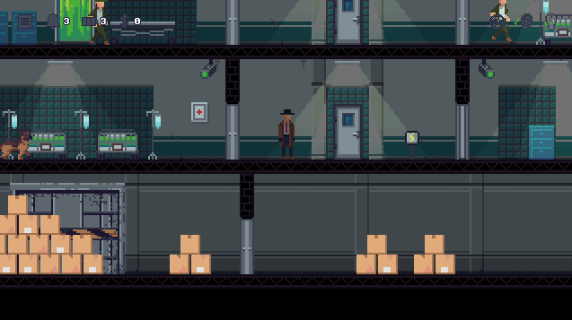
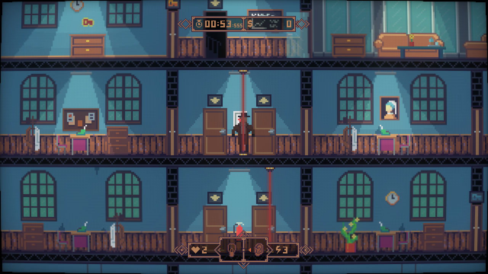

# Moonshot: The Great Espionage

## About

Moonshot is a stealth puzzle platformer that puts you in the role of a spy of a fictional country in the 'moon race' era. In competition with the USA and the Soviet Union, you will have to use espionage and sabotage to make sure that your nation will be the first on the moon.

## Steam

Moonshot will be available on Steam very soon (maybe some more months). Make sure to wishlist it on Steam to support us.

## Planned Features

- Story Driven Background - Discover the story of an agent who can change the history of the Moon Race forever. It's up to you which of the three nations wins the race.
- 30+ Challenging Levels - Lots of varied levels ensure that you won't get bored. Visit historical as well as freely fictional places to guide the fate of your nation.
- Lot's of Player Upgrades - Of course, if you're already breaking in somewhere, you might as well enrich yourself personally. Use the money to unlock new abilities or boosts that will help you master the game even better.
- Explore in your OWN way - Most levels are designed so that there is no single correct path. Many possibilities lead to the goal. Create your own way.
- Lots of Minigames - To keep it interesting, many mini-games are included, so you don't have to do the same mini-game for the 100th time.

## Screenshots

## ​Team

​The NimbleBeasts Collective is a small and open independent development studio where anyone can participate - worldwide. Support us, become part of the collective and buy our games, because they are really good.

- mago - PM & Pixels, Levels
- knightmare - Coding
- kodkuce - Levels
- SpaceCastle - Music & Sounds
