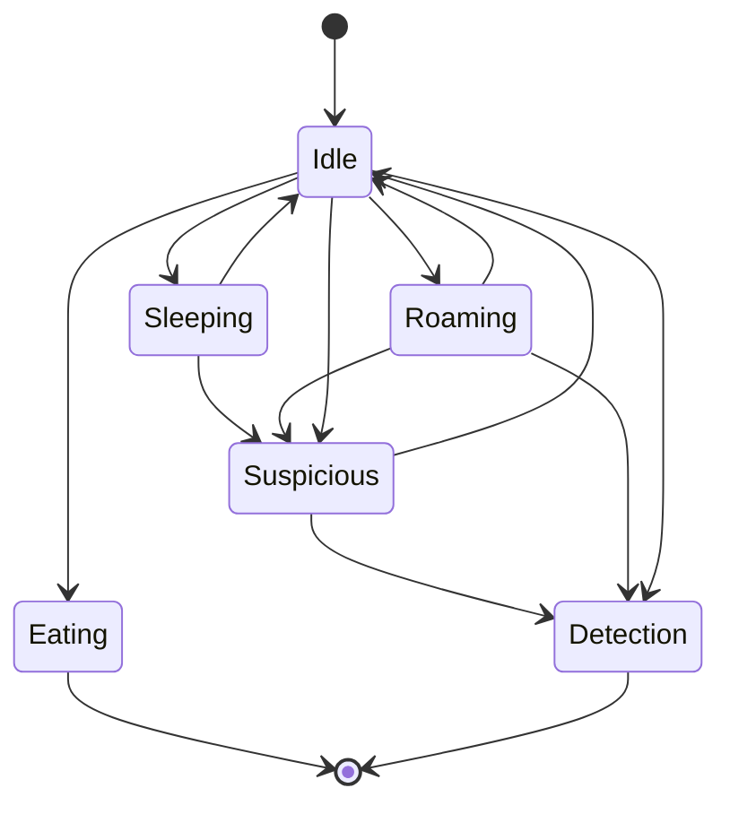
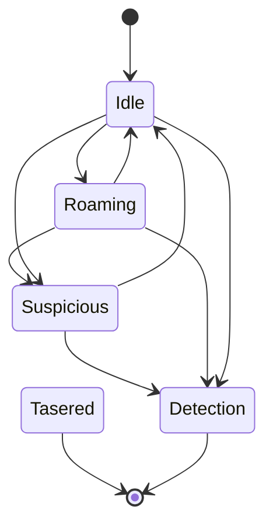
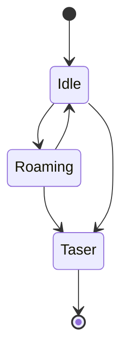

# GDD Masterplan

## GDD Part 2

This is part 2 of the GDD.

> Warning: This file contains not only spoilers but the whole story and twists :)

How to use this. Use VS Code and install Markdown Preview Mermaid to view the state machines. Press Ctrl + K V to preview this file.

## High Concept

In the race for the first manned moon mission, there is a new challenger. Ustria. You are part of the Ustria Secret Service and have to steal plans to build rockets from the leading space nations. The player has to penetrate buildings, overcome security systems and take out guards to complete his task. The game is supposed to be a little parody of secret services in Eastern Bloc countries. Which are chronically underfinanced and technologically disconnected.

## Objective

The game is mission-based and is triggered by orders from the Chief of Intelligence. Most missions are sabotage and theft. But there can also be missions where the player enters a wrong house, for example because of a lack of intelligence, and finds only an old granny and her cat. Or the boss sends the player on a mission to monitor his own wife and uncover an affair.
The main goal is to steal enough knowledge or sabotage other powers to the extent that the player's nation can actually carry out a manned moon mission. As the game progresses, the missions become more difficult as the technology to be stolen becomes more and more cutting edge.

# Missions

## Mission Progress

To make it less linear, we give the player the choice of selecting wether he goes on a mission for Ustria or perform a sabotage mission.
After every successful mission the player returns to the HQ and sees instead of the mission briefing a race screen:


After each (default story) mission points will be added to the nations, e.g.:

- Ustria: 10 pts
- UdSSR: 5 pts
- USA: 5-20 pts in nonlinear function

There can be 3 outcomes in the space race:

- If the player does not sabotage at all USA will win.
- If the player only sabotages the USA, UdSSR will win.
- Player has to meet a perfect match to let Ustria win (e.g. at least 3x USA; 2x UdSSR)

There is an alternate secret ending when you do flirting with the secretary.

## Missions

The overall story remains the same but its streched. Also some minor substories which expands over 3-4 levels could help to improve the overall experience.
Ideas are welcome :D

Total Missions: 20 linear, 10 sabotages, 1 love

### Linear Story Missions

| #   | Title | Desc                          | Location |
| --- | ----- | ----------------------------- | -------- |
| 0   |       | HQ Trainingsmission           | Ustria   |
| 1   |       | Rocket 1                      | UdSSR    |
| 2   |       | Rocket 2                      | UdSSR    |
| 3   |       | Rocket 3                      | UdSSR    |
| 4   |       | Affaire                       | Ustria   |
| 5   |       | Affaire 2                     | Ustria   |
| 6   |       | Rocket 4                      | UdSSR    |
| 7   |       | Rocket 5                      | UdSSR    |
| 8   |       | Affaire 3                     | Ustria   |
| 9   |       |                               | USA      |
| 10  |       |                               | UdSSR    |
| 11  |       |                               | USA      |
| 12  |       |                               | USA      |
| 13  |       |                               | USA      |
| 14  |       |                               | USA      |
| 15  |       |                               | UdSSR    |
| 16  |       |                               | UdSSR    |
| 17  |       | Apollo 1                      | USA      |
| 18  |       | Apollo 2                      | USA      |
| 19  |       | Apollo 3                      | USA      |
| 20  |       | Epic Showdown, but no idea :) | Ustria   |

#### Substories

##### Affaire

Affaire: Same thing as before go after boss wife
Affaire 2: Your boss wants you to infiltrate the affaires house, taser him and bring the body to the car.
Affaire 3: You have to infiltrate a law firm and steal the marriage contract from the safe.

### Sabotage Missions

After mission 5 the player can receive the first sabotage mission as a forecast of choice. After mission 10 the player can chose sabotage missions before playing the story line mission.
There shall be at least 5 sabotage missions available per nation.

**USA**
| # | Title | Desc |
| --- | ----- | ------------------- |
| 1 | | |
| 2 | | |
| 3 | | |
| 4 | | |
| 5 | | |

**UdSSR**
| # | Title | Desc |
| --- | ----- | ------------------- |
| 1 | | |
| 2 | | |
| 3 | | |
| 4 | | |
| 5 | | |

### Secretary Flirt Ending

The secretary wont give you any missions, but you can flirt with her. Which will lead to a secret mission instead of level 20.
Resulting in an alternate ending

# Mechanics

## Moveable Camera

Holding down a specific button + cursor keys will result in moving the camera only. So the player can peak into next room or something.
Movement shall be limited to specific amount of pixel, camera transition should be interpolated (smooth). Releasing the button, will return
to original camera location with a sped up transition.

# Level Design Elements

## Dog

- Dog is roaming along a paths.
- Idle State is a transition state
- The dogs default behaviour should be setable in the editor (sleeping or roaming)
- If the default behaviour is sleeping, the dog will never leave the sleeping state unless the player emits a loud sound (e.g. failing a minigame within range.)
- If the default behaviour is roaming, the dog will walk along the path until a timer counted down and then going for sleep for a specific timer amount before returning to roaming
- When the player emits a loud sound or the dog first sees the player it becomes suspicious
- In suspicious state the dog walks in the direction of the emited noise
- If the player is not in view frustrum of the dog, the dog continues chasing the default state
- If the player is in view frustrum of the dog, the dog goes into detection mode. Emits barking and the sure detection is decreased by one
- Tasered dog will remaing sleep forever
- Found dog body is not suspicious, but can be carried by the player



## Guard

As before with the following changes:

- Tasered guard will remain in sleeping state
- If guard detects a tasered body it will go into detection and a sure detection is being triggered
- Body can be picked up by the player to hide it



## Elite Guard

- Cannot be tasered
- Tasers you when in range -> Game Over
- Slower than guards
- Very limited sight
- They basically wont call a detection, but when you are in range its immediately over



## Cameras

- Like before: Static cam or rotating; can be deactivated by wirecut game
- Camera view frustrum is lightly highlighted when close to a camera
- Open for discussion: Player upgrade makes the view frustrum of the camera more visible

## Light

- Alternate light (forms)

## Laser Detectors

- No changes

## Body Hiding

Player can pick up stunned bodys to hide them. Bodies visible, will trigger alert by guards. More: See carry objects

## Carry Objects

Player can carry objects:

- Makes him slower
- Cant hide in the dark (wall dodge)
- Cant crouch
- Cant use elevator platforms
- Cant interact

## Buttons and switches

Buttons can unlock mechanical doors or turn lights on/off.

## Pressure Triggered Buttons

Like normal buttons but it turns off when no pressure is on the button. Could be any carry-able object or even a stunned body.

## Minigames

### Wirecut

- Timer needs to be shorter
- The color of the words shall not be identical

### Connect 5

- We may need some explainer for this

### Ez Lockpick

- No change

### Keypad

- No change

### Lockpick (Safe)

- No change

### Cryptogram

Encrypt encoded messages. Some missions may require the player to encrypt messages like this:

```
___e_ __e _e_ ____
Ofaja qoj ojx nkqk (some symbols)

Roses are red blah
```

The player sees blank input fields, and some hinted letter. Instead of the text he sees only symbols representing the word.
A wheel with the remaing letters is used to set single letters to a space. Similiar to the android game cryptogram.

#### kodkuce ideas :)

- Vacum pads for climbing vertical vents and building fasade -duno if pickable of upgrade
- Hmm something trow ( coin-Hitman, cigars-Commandos, wallet, teadybear, or something from envoriment )
- I think we should not go mark of njinja way where you can kill/zap evrybody i think we should make like more a agent non voilent dude and comic storyline
- Mouse pet for distractions or duno :)

# Required Art

## Screen Art

| Name       | Desc                                                                 |
| ---------- | -------------------------------------------------------------------- |
| RaceScreen | A screen for the screen race                                         |
| UsaWin     | Maybe actual moon landing screen                                     |
| UdSSRWin   | Maybe a soyuz rocket flying to the moon                              |
| UstriaWin  | Some flappy variant of the US moon landing with duct tape and stuff  |
| LoveWin    | Some Caribean beach where a couple (silhouette) walks in the sundown |
