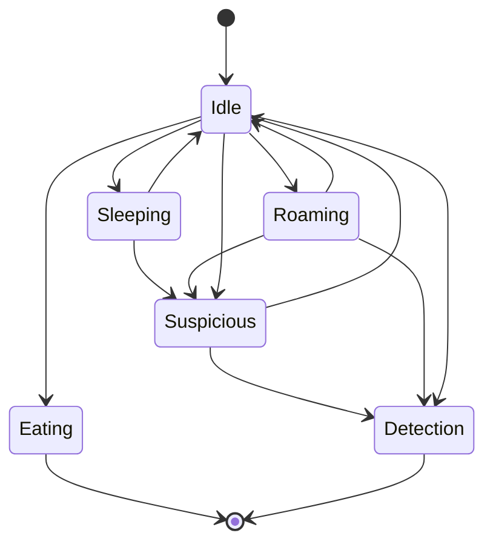
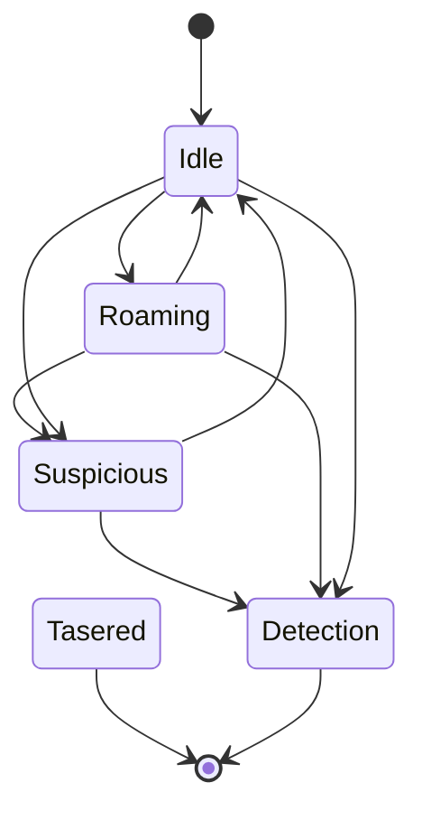
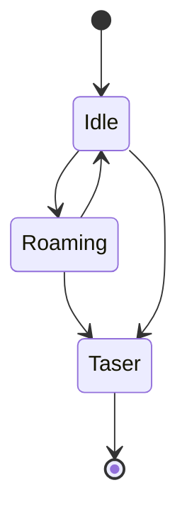

# GDD Masterplan

## GDD Part 2

This is part 2 of the GDD.

> Warning: This file contains not only spoilers but the whole story and twists :)

How to use this. Use VS Code and install Markdown Preview Mermaid to view the state machines. Press Ctrl + K V to preview this file.

## High Concept

In the race for the first manned moon mission, there is a new challenger. Ustria. You are part of the Ustria Secret Service and have to steal plans to build rockets from the leading space nations. The player has to penetrate buildings, overcome security systems and take out guards to complete his task. The game is supposed to be a little parody of secret services in Eastern Bloc countries. Which are chronically underfinanced and technologically disconnected.

## Objective

The game is mission-based and is triggered by orders from the Chief of Intelligence. Most missions are sabotage and theft. But there can also be missions where the player enters a wrong house, for example because of a lack of intelligence, and finds only an old granny and her cat. Or the boss sends the player on a mission to monitor his own wife and uncover an affair.
The main goal is to steal enough knowledge or sabotage other powers to the extent that the player's nation can actually carry out a manned moon mission. As the game progresses, the missions become more difficult as the technology to be stolen becomes more and more cutting edge.

# Missions

## Mission Progress (WP-3)

To make it less linear, we give the player the choice of selecting wether he goes on a mission for Ustria or perform a sabotage mission.
After every successful mission the player returns to the HQ and sees instead of the mission briefing a race screen:


After each (default story) mission points will be added to the nations, e.g.:

- Ustria: 10 pts
- USSR: 5 pts
- USA: 5-20 pts in nonlinear function

There can be 3 outcomes in the space race:

- If the player does not sabotage at all USA will win.
- If the player only sabotages the USA, USSR will win.
- Player has to meet a perfect match to let Ustria win (e.g. at least 3x USA; 2x USSR)

There is an alternate secret ending when you do flirting with the secretary.

## Missions

The overall story remains the same but its streched. Also some minor substories which expands over 3-4 levels could help to improve the overall experience.
Ideas are welcome :D

Total Missions: 20 linear, 10 sabotages, 1 love

### Linear Story Missions

Please note that the level difficulty shall rise.

See online doc

#### Substories

#### Apollo 8

December 1968. Apollo 8 sucessfully orbited the moon, get the blackbox of the capsule. USA Labs

#### Soyuz 1

April 1967. Before USSR can launch the soyuz, destroy one of the solar panel of the command capsule. This mission is on a driving train. (Bg is parallax scrolling).

#### Pre-Soyuz

During 1967. Rumors spread the USSR has also a rocket ready for lunar landing. Kidnap the lead scientiest. USSR/Hotel

##### Apollo 1

Januar 1967. Intel got informations that the USA has a space ship ready for lunar landing. To disrupt the progress, sabotage the command module in the lab before they can launch it. (Resulting in burn out of the command capsule killing all 3 crew members in an planned test flight). USA, factory/lab.

##### Luna 10

1966 USSR place a satellite in moons orbit to gather more informations. You have to look for the results. Safe mission in USSR. Space lab or something.

##### Luna 3

In the 1963, is trying to gather landing informations by stealing pictures made by the Luna 3 moon mission in 1959 ussr. Mission environment is the space flight archive of USSR.

##### Atlas 9

May 1963. Earth Orbiter Mission. Capture the pilot to get more information on his physical behaviour after long time stay in space. (Hospital USA)

##### Rocket 1

May, 28 1961 (somedays after speech of Kennedy). Ustria Intel came to the conclussion, that russian space tech is the most advanced. As Yuri Gagarin was the first man in space and human in orbit fly. Player shall look for plans of the Vostok-K 8K72K rocket and steal it from a safe.

##### Rocket 2

September 1961 After Vostok 2 mission Vostok-2 mission (Gherman Titov spend one day in space), the intel want documents about the effect of space flight on the human body and has to infiltrate a soviet military hospital and look for the documents in file cabines.

##### Chimpanzee

November 27, 1961 The intel has reported that Mercury-Atlas 5 will be the first manned US mission to orbit the Earth. The goal is to infiltrate the NASA lab training site and take pictures of it. To actually get an understanding how they prepare their astronauts. Turns out "Enzo" is not a man but a chimpanzee.

##### Affaire

1962
Affaire: Same thing as before go after boss wife
Affaire 2: Your boss wants you to infiltrate the affaires house, taser him and bring the body to the car.
Affaire 3: You have to infiltrate a law firm and steal the marriage contract from the safe.

##### Rocket 3

Early 1962 Ustria is about to completet the rocket but Intel told that USSR is developing a new booster for the Vostok-K rockets. The player has to steal the plans.

##### Rocket 4

Later 1962 Ustria finished the rocket and is launching a first unmaned flight but the control unit does not work. So the player has to steal one from USSR as theirs is 100% compatible. Player needs to carry out a blackbox from the building.

### Sabotage Missions

After mission 5 the player can receive the first sabotage mission as a forecast of choice. After mission 10 the player can chose sabotage missions before playing the story line mission.
There shall be at least 5 sabotage missions available per nation.

**USA**
| # | Title | Desc |
| --- | ----- | ------------------- |
| 1 | | |
| 2 | | |
| 3 | | |
| 4 | | |
| 5 | | |

**USSR**
| # | Title | Desc |
| --- | ----- | ------------------- |
| 1 | | |
| 2 | | |
| 3 | | |
| 4 | | |
| 5 | | |

### Secretary Flirt Ending

The secretary wont give you any missions, but you can flirt with her. Which will lead to a secret mission instead of level 20.
Resulting in an alternate ending

# Mechanics

## Moveable Camera (WP-4)

Holding down a specific button + cursor keys will result in moving the camera only. So the player can peak into next room or something.
Movement shall be limited to specific amount of pixel, camera transition should be interpolated (smooth). Releasing the button, will return
to original camera location with a sped up transition.

## Weapons

### Taser Gun

- Like before

### Stones (WP-2)

- Infinite amount
- Distraction
- The longer you hold the button the further the stone throw
- Predicted flying curve

### Snacks (WP-2)

- Must be picked up
- Dogs will be satisfied
- Can also be thrown as distraction for guards

## Archive

We introduce a new npc where the player can replay certain missions - without money reward ofc.

## Controls

| Controls    | Key 1         | Key 2         | Gamepad    |
| ----------- | ------------- | ------------- | ---------- |
| Move        | Wasd + Cursor | Wasd + Cursor | Left Stick |
| Interaction | E             | X             | A          |
| Weapon      | F             | Z/Y           | B          |
| Cancel      | Q             | V             | X          |
| Menu        | ESC           | ESC           | Menu       |
| Dodge       | Space         | Space         | Y          |
| Selection   | R             | C             | RB         |

### Interaction

- Npc interaction
- Dialogue typing stop (fast forward), next page
- Menu interaction
- Minigame interaction
- Body pickup and laying down

### Weapon

- Usage of selected weapon

### Cancel

- Skips all dialogues
- Exits minigame
- Cancels stone throw

### Menu

- Ingame menu

### Dodge

- Walldodge

### Selection

- Switches Weapon
- Holding down (~600ms) + cursors can move camera (weapon selection remains same)

# Level Design Elements

## Dog (WP-5)

- Dog is roaming along a paths.
- Idle State is a transition state
- The dogs default behaviour should be setable in the editor (sleeping or roaming)
- If the default behaviour is sleeping, the dog will never leave the sleeping state unless the player emits a loud sound (e.g. failing a minigame within range.)
- If the default behaviour is roaming, the dog will walk along the path until a timer counted down and then going for sleep for a specific timer amount before returning to roaming
- When the player emits a loud sound or the dog first sees the player it becomes suspicious
- In suspicious state the dog walks in the direction of the emited noise
- If the player is not in view frustrum of the dog, the dog continues chasing the default state
- If the player is in view frustrum of the dog, the dog goes into detection mode. Emits barking and the sure detection is decreased by one
- Tasered dog will remaing sleep forever
- Found dog body is not suspicious, but can be carried by the player



## Guard (WP-6)

As before with the following changes:

- Tasered guard will remain in sleeping state
- If guard detects a tasered body it will go into detection and a sure detection is being triggered
- Body can be picked up by the player to hide it



## Elite Guard (WP-7)

- Cannot be tasered
- Tasers you when in range -> Game Over
- Slower than guards
- Very limited sight
- They basically wont call a detection, but when you are in range its immediately over



## Cameras

- Like before: Static cam or rotating; can be deactivated by wirecut game
- Camera view frustrum is lightly highlighted when close to a camera
- Open for discussion: Player upgrade makes the view frustrum of the camera more visible

## Light

- Alternate light (forms)

## Laser Detectors

- No changes

## Body Hiding

Player can pick up stunned bodys to hide them. Bodies visible, will trigger alert by guards. More: See carry objects

## Carry Objects

Player can carry objects:

- Makes him slower
- Cant hide in the dark (wall dodge)
- Cant crouch
- Cant use elevator platforms
- Cant interact

## Buttons and switches

Buttons can unlock mechanical doors or turn lights on/off.

## Pressure Triggered Buttons

Like normal buttons but it turns off when no pressure is on the button. Could be any carry-able object or even a stunned body.

## Civilians WP-10

Civilians dont have an direct impact on the gameplay. They can either follow a path (if attached) or idle (if no path attached). Civilians have multiple type of skins (e.g. scientist, normal guy, normal girl, betrayer). The skin is selected via an exported enum variable "skin". All civilians are stun-able and can be carried. They dont react to stones or meat. The betrayer can be mission objective. Civilians stop on path points for a few msec before continue the path. Guess this could be sourced out as shared between most npcs.
Civilians shall have a exported bool isHostileArea. If isHostileArea is true and the player walks in the FOV, the civilian get on his knees and hide. He will remain in that state forever. If a guard detects the kneeing civilian, the guard will ring the alarm. If isHostileArea the civilian does not react to the player, FOV can be removed.

## Minigames

### Wirecut

- Timer needs to be shorter
- The color of the words shall not be identical

### Connect 5

- We may need some explainer for this

### Ez Lockpick

- No change

### Keypad

- No change

### Lockpick (Safe)

- No change

### Cryptogram

Encrypt encoded messages. Some missions may require the player to encrypt messages like this:

```
___e_ __e _e_ ____
Ofaja qoj ojx nkqk (some symbols)

Roses are red blah
```

The player sees blank input fields, and some hinted letter. Instead of the text he sees only symbols representing the word.
A wheel with the remaing letters is used to set single letters to a space. Similiar to the android game cryptogram.

# Steam Integration

We will use Gramps GodotSteam Integration. It's easy to use and maintained.

## Achievements

Achievements are pretty easy to implement.

It should be done by emit a signal:

`Events.emit_signal("steam_achievement_unlock", Types.SteamAchievements.TestId)`

The GameManager shall handle this signal. AFAIK: The function requires to check if the player already has this achievement or not. So there is maybe a list to be downloaded at start.

TODO: come up with new achievement ideas (~20)

| Name             | Desc                  |
| ---------------- | --------------------- |
| TutorialComplete | Complete the tutorial |

## Stats

We should utilize some stats like how many tries did the player needed and the time he spend in the level.

## Leaderboard

Im not sure rn if we shall integrate this. As the game ment to be played slow.

# Required Art

## Screen Art

| Name       | Desc                                                                 |
| ---------- | -------------------------------------------------------------------- |
| RaceScreen | A screen for the screen race                                         |
| UsaWin     | Maybe actual moon landing screen                                     |
| USSRWin    | Maybe a soyuz rocket flying to the moon                              |
| UstriaWin  | Some flappy variant of the US moon landing with duct tape and stuff  |
| LoveWin    | Some Caribean beach where a couple (silhouette) walks in the sundown |

## Pixel Art

| Name       | Desc                          |
| ---------- | ----------------------------- |
| Player     | Body carry, object carry anim |
| ArchiveNPC |                               |
| Dog        |                               |

## Sound

## Music

# Ideas Collection

Post every thought you have in here
