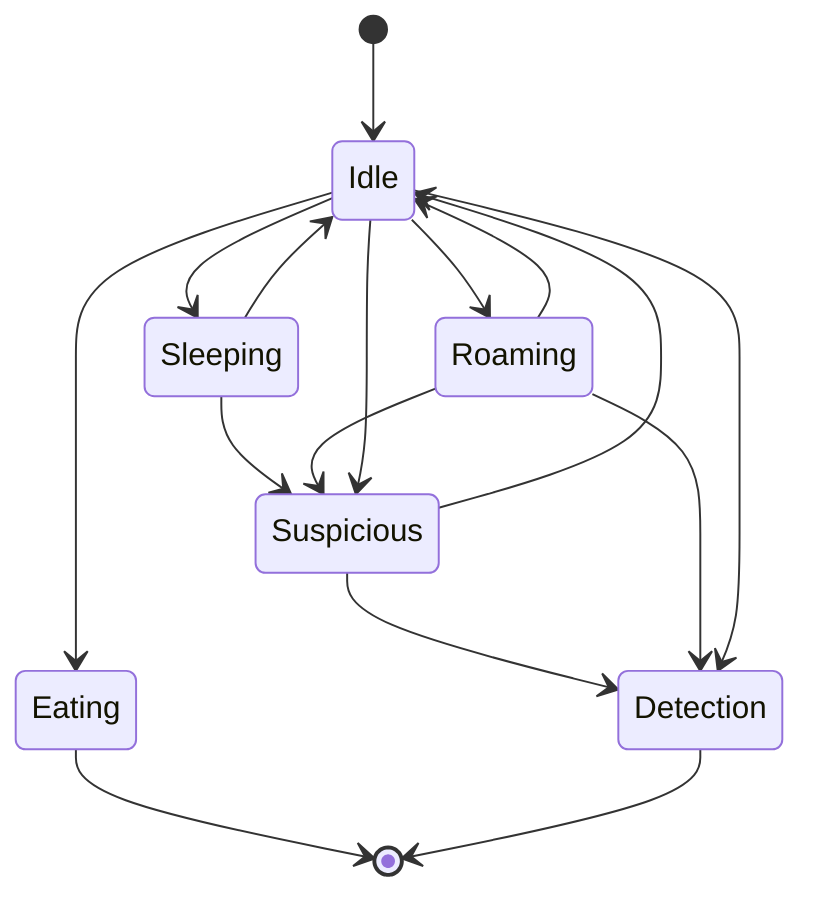
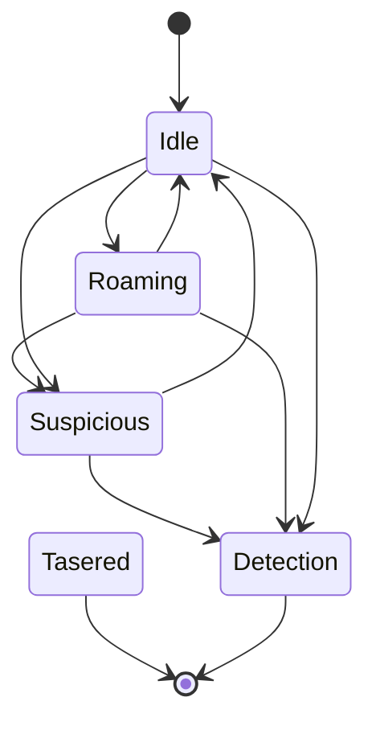
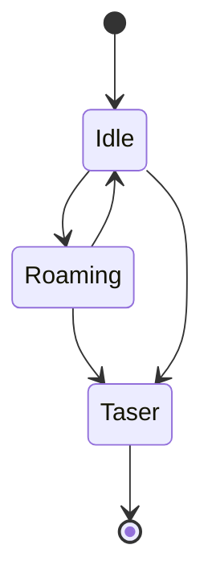

# GDD Masterplan

## GDD Part 2

This is part 2 of the GDD.

## High Concept

In the race for the first manned moon mission, there is a new challenger. Ustria. You are part of the Ustria Secret Service and have to steal plans to build rockets from the leading space nations. The player has to penetrate buildings, overcome security systems and take out guards to complete his task. The game is supposed to be a little parody of secret services in Eastern Bloc countries. Which are chronically underfinanced and technologically disconnected.

## Objective

The game is mission-based and is triggered by orders from the Chief of Intelligence. Most missions are sabotage and theft. But there can also be missions where the player enters a wrong house, for example because of a lack of intelligence, and finds only an old granny and her cat. Or the boss sends the player on a mission to monitor his own wife and uncover an affair.
The main goal is to steal enough knowledge or sabotage other powers to the extent that the player's nation can actually carry out a manned moon mission. As the game progresses, the missions become more difficult as the technology to be stolen becomes more and more cutting edge.

## Level Design Elements

### Dog

- Dog is roaming along a paths.
- Idle State is a transition state
- The dogs default behaviour should be setable in the editor (sleeping or roaming)
- If the default behaviour is sleeping, the dog will never leave the sleeping state unless the player emits a loud sound (e.g. failing a minigame within range.)
- If the default behaviour is roaming, the dog will walk along the path until a timer counted down and then going for sleep for a specific timer amount before returning to roaming
- When the player emits a loud sound or the dog first sees the player it becomes suspicious
- In suspicious state the dog walks in the direction of the emited noise
- If the player is not in view frustrum of the dog, the dog continues chasing the default state
- If the player is in view frustrum of the dog, the dog goes into detection mode. Emits barking and the sure detection is decreased by one
- Tasered dog will remaing sleep forever
- Found dog body is not suspicious, but can be carried by the player



### Guard

As before with the following changes:

- Tasered guard will remain in sleeping state
- If guard detects a tasered body it will go into detection and a sure detection is being triggered
- Body can be picked up by the player to hide it



### Elite Guard

- Cannot be tasered
- Tasers you when in range -> Game Over
- Slower than guards
- Very limited sight
- They basically wont call a detection, but when you are in range its immediately over



### Cameras

- Like before: Static cam or rotating; can be deactivated by wirecut game
- Camera view frustrum is lightly highlighted when close to a camera
- Open for discussion: Player upgrade makes the view frustrum of the camera more visible

### Light

- Alternate lights

### Laser Detectors

- No changes

### Minigames

#### Wirecut

- Timer needs to be shorter
- The color of the words shall not be identical

#### Connect 5

- We may need some explainer for this

#### Ez Lockpick

- No change

#### Keypad

- No change

#### Lockpick (Safe)

- No change

#### Cryptogram

Encrypt encoded messages. Some missions may require the player to encrypt messages like this:

```
___e_ __e _e_ ____
Ofaja qoj ojx nkqk (some symbols)

Roses are red blah
```

The player sees blank input fields, and some hinted letter. Instead of the text he sees only symbols representing the word.
A wheel with the remaing letters is used to set single letters to a space. Similiar to the android game cryptogram.
